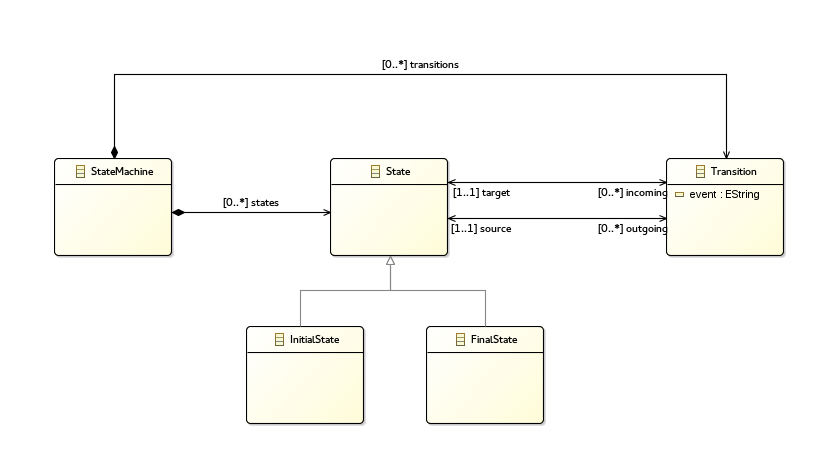
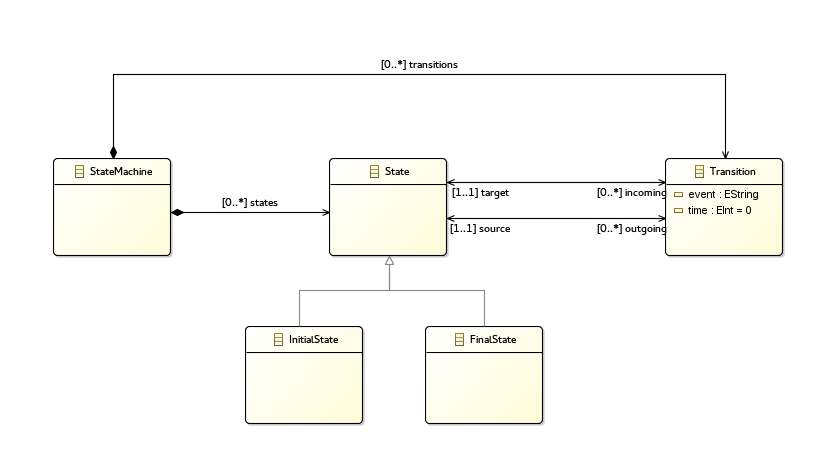
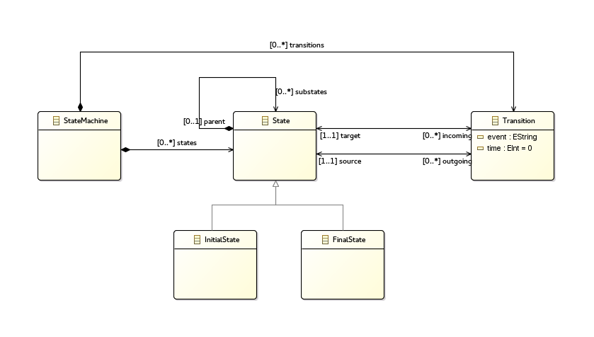



In this tutorial we will design 4 variations of the FSM language defined in [this tutorial](newlanguage.html)
and thanks to the Melange type system we see relations between different but close languages.

### A family of language

#### Simple FSM

If we do a list of elements for our language we have:

 - A State Machine
 - Some States
 - An Initial State (it's the entry point of the State Machine)
 - A Final State (we need also an exit point)
 - Some Transitions

Each point of this list will be an element in the model representing our language.

#### Others FSM

For other variantes of FSM language process in the same way as for the Simple FSM project.

##### Timed FSM

We add an EAttribut **time : EInt** in Transition

##### Composite FSM

We add a containment EReference **substates : State** in State

##### Timed composite

We add same changes as Timed and Composite FSM

### The Melange world

#### New project

~~~
language SimpleFSM {
	ecore "platform:/resource/org.sample.fsm/model/fsm.ecore"
	with finitestatemachines.StateMachineAspect
	with finitestatemachines.StateAspect
	with finitestatemachines.TransitionAspect
	exactType SimpleFSMMT
}

language TimedFSM {
	ecore "platform:/resource/org.sample.timedfsm/model/fsm.ecore"
	with finitestatemachines.timed.StateMachineAspect
	with finitestatemachines.timed.StateAspect
	with finitestatemachines.timed.TransitionAspect
	exactType TimedFSMMT
}

language CompositeFSM {
	ecore "platform:/resource/org.sample.compositefsm/model/fsm.ecore"
	with finitestatemachines.composite.StateMachineAspect
	with finitestatemachines.composite.StateAspect
	with finitestatemachines.composite.TransitionAspect
	exactType CompositeFSMMT
}

language TimedCompositeFSM {
	ecore "platform:/resource/org.sample.timedcompositefsm/model/fsm.ecore"
	with finitestatemachines.timedcomposite.StateMachineAspect
	with finitestatemachines.timedcomposite.StateAspect
	with finitestatemachines.timedcomposite.TransitionAspect
	exactType TimedCompositeFSMMT
}
~~~

#### The outline

//typing relation
